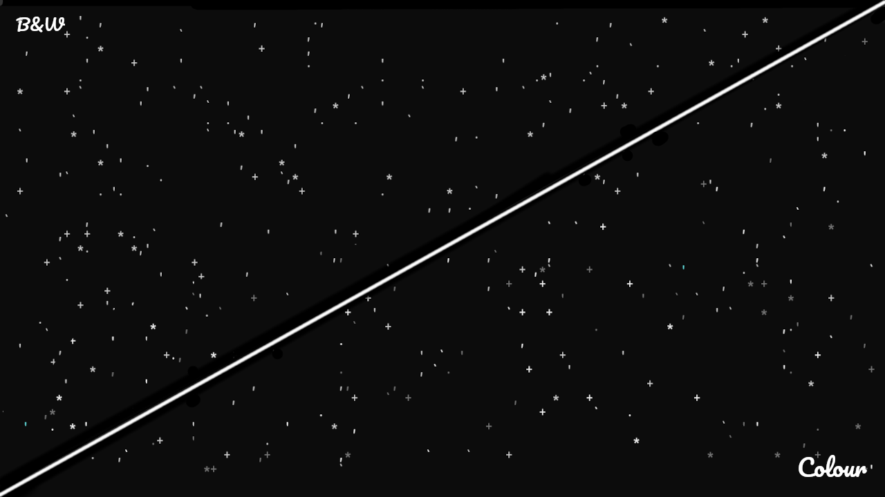

# libScricon: The Simple Graphical Console Library
Copyright (C) 2021 Jyothiraditya Nellakra

## Pronunciation & Etymology of the Name
Scricon is pronounced with the _scr-_ of _script_ and the _icon_ of... well... the word _icon_; its representation in the international phonetic alphabet is /skɹaɪkən/.

I wanted to make the name a portmanteau of the description. Alas, Sgricon does not a valid sequence of sounds in English make. However, the _graph-_ part of _graphical_ comes from a greek word which could mean 'write', so I replaced it with the _scr_ prefix from latin which is also related to writing, whence the _c_ in _scricon_.

## Example Output

The following are screenshots of the output of the monochrome `starfield` and colour `nebulae` demos included with the library. It is made using the technology provided by `LSC_buffer.h`.

The font used in the above image is [Pacifico](https://fonts.google.com/specimen/Pacifico).

## Building & Running It

To compile the code, you can run `make`. This will produce a large number of programs as well as `libScricon.a` which you will need to link other programs with this library. If your goal is to compile your own code, make sure to include the `include` folder from the libScricon source tree in the include path for your program compilation.

If you wish to instead run the programs, you can run `<program> --help` to find the usage details of each of them individually.

When you're done, if you want to clean up after yourself, you can run `make clean`, which will automatically delete all programs, object files, and `libScricon.a`

---

Happy coding! :)
